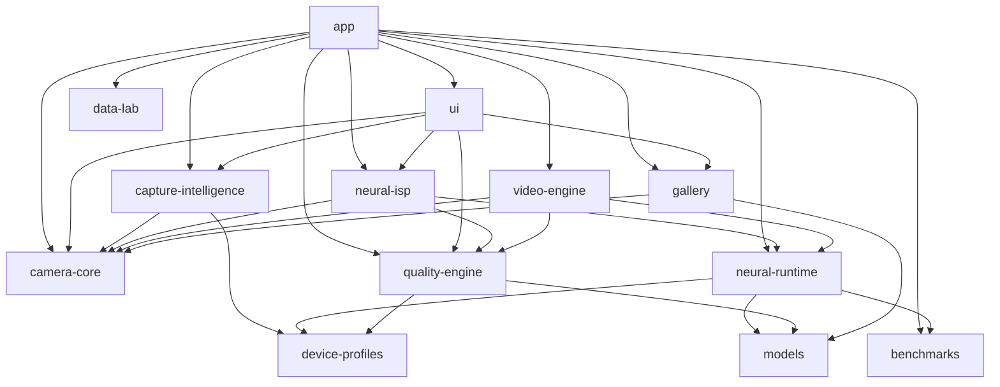

# Neural Camera System Architecture & Development Constitution

## 1. High-Level Vision & Operating Philosophy
Neural Camera is a rootless, device-adaptive computational photography platform built for modern Android devices. Its target is to function as a professional photographic instrument, combining modern Camera2 controls with hardware-accelerated neural image processing while maintaining strict fidelity to physical reality.

Target design (goals, not current state; see [`AUDIT.md`](AUDIT.md) for what exists and [`PROOF_GATES.md`](PROOF_GATES.md) for what is proven):
- Plan multi-frame exposures before shutter release. *(Contracts exist; not wired into capture.)*
- Capture synchronized sensor telemetry (gyro, accel, exposure, timestamps). *(Synchronizer exists; not attached to burst frames.)*
- Run temporal alignment and classical/neural reconstruction, using an accelerator only after it is proven on the device. *(Classical merge runs on the CPU; no accelerator is proven.)*
- Check reconstructed images with Reality Guard. *(A heuristic divergence check, not hallucination detection.)*
- Preserve the original capture alongside the master photograph. *(Today the "original" is the reference frame's luma as a gray JPEG, not sensor data; RAW exists only in the Gate 1 probe.)*

### 1a. Pipeline paths (kept separate)

| Path | Responsibility | Where | State |
|---|---|---|---|
| **LIVE PREVIEW** | Low-latency preview; no heavy processing on the preview stream | `RealCamera2Controller` repeating request → `SurfaceView` | Code exists, NOT_TESTED on device |
| **CAPTURE PIPELINE** | Camera2 session, 3A, frame scheduling, RAW/YUV capture, metadata, burst orchestration | `camera-core` (Camera2), `capture-intelligence` `threea/`, `orchestration/`, `motion/`, `scene/`, `policy/` | YUV burst runs on AE auto; 3A/orchestration contracts are JVM-tested, not wired |
| **COMPUTATIONAL PHOTOGRAPHY** | Alignment, quality assessment, temporal merge, RAW processing, HDR, neural restoration, colour | `neural-isp` `raw/`, `calibration/`, `temporal/`, `color/`; `quality-engine` `frame/`; `neural-runtime` | Merge/colour/RAW front end JVM-tested on synthetic data; HDR and neural restoration missing |
| **OUTPUT + GALLERY** | JPEG/HEIF/Ultra HDR, metadata, atomic storage, indexing, review | `neural-isp` `encode/`; `gallery` `storage/`, `provenance/` | JPEG/DNG encoders and atomic storage exist; HEIF/Ultra HDR missing |
| **AI STUDIO** | Creative/generative pipeline, never mixed with normal capture | not implemented | `PipelinePath.AI_STUDIO` is the only path allowed to record `ContentOrigin.GENERATED`; enforced by `ProvenanceRecord` and `SchedulingPolicy` |

Cross-cutting contracts: `models` `execution/` (SUCCESS / DEGRADED / FAILED stage outcomes, evidence states, pipeline
paths, content origin) and `neural-runtime` `registry/` (model artifacts, checksums, QNN pairing, rollback).
Normal camera modes are reality-preserving: captured → reconstructed. A fallback is always reported as DEGRADED with
both the intended and the actual implementation.

---

## 2. Multi-Module Topology & Dependency Direction

The architecture enforces a strict one-directional dependency graph:
```
UI
 ↓
Application Orchestration (:app)
 ↓
Camera / Capture (:camera-core, :capture-intelligence)
 ↓
Processing / Runtime (:neural-runtime, :neural-isp, :quality-engine, :video-engine)
 ↓
Output (:gallery)
```
Supporting horizontal systems integrate exclusively through explicit interfaces:
- `:models`
- `:device-profiles`
- `:benchmarks`
- `:data-lab`



### Module Responsibilities:
1. `:models`: Strict model descriptors, precision types (FP32, FP16, INT8, INT4), hardware backend targets, compatibility contracts, and manifest validators.
2. `:device-profiles`: Declarative versioned device capabilities, camera specs, thermal thresholds, and device profiles (OnePlus 15, Generic Flagship, Generic Fallback).
3. `:benchmarks`: Empirical benchmarking engine, latency percentiles (median, p95, p99), memory peak tracking, privacy-safe telemetry, and 13-category structured logger.
4. `:quality-engine`: Image quality evaluator, sensor confidence estimator, and the Reality Guard heuristic divergence check (not hallucination detection or provenance).
5. `:camera-core`: Camera2 contracts, deterministic state machine (`CameraState`), structured error hierarchy (`CameraSystemError`), buffer leasing contracts (`FrameBufferHandle`), and bounded ring buffer repositories.
6. `:capture-intelligence`: Scene luminance & motion estimation, universal capture planning across shooting modes (AUTO, PRO, MASTER, AUTHENTIC).
7. `:neural-runtime`: Model registry, adaptive scheduler, thermal budget manager, memory allocation manager, the `InferenceRuntime`/`InferenceBackend` contracts with in-process attribution, the FP32 CPU reference backend, an ONNX Runtime backend (CPU EP, QNN EP on the HTP) and the Gate 2 proof harness. No hardware execution has been observed yet.
8. `:neural-isp`: Multi-frame temporal fusion, classical baseline ISP fallback pipeline (Zero Fake AI).
9. `:video-engine`: Video pipeline enforcing bounded compute per frame (selective keyframe enhancement, hardware passthrough).
10. `:gallery`: Non-destructive dual-storage repository (Original + Master + JSON metadata).
11. `:ui`: Minimalist, Leica/Zeiss-inspired Jetpack Compose user interface, tactile lens selector, mode carousel, subtle NEURAL status, diagnostics sheet.
12. `:data-lab`: Reference regression dataset (14 controlled scenes) and automated regression verification.
13. `:app`: Application entry point, dependency injection, and activity lifecycle management.

---

## 3. Threading Architecture & Concurrency Rules

In adherence to Section 9 of the Constitution:
- **Main / UI Thread**: Solely reserved for Compose UI rendering and state observation. Zero disk IO, zero buffer allocations, zero model inferences.
- **Camera Dispatcher**: Dedicated handler/dispatcher for Camera2 device callbacks, state callbacks, and request queue dispatching.
- **Frame Analysis Dispatcher**: Lightweight preview analysis, scene lux calculation, and gyroscope motion integration.
- **Neural Inference Dispatcher**: Off-thread background executor for hardware accelerator invocation (NPU / GPU / CPU).
- **Image Processing Dispatcher**: High-performance multi-threaded compute for classical ISP routines, spatial filtering, and tone mapping.
- **IO / Storage Dispatcher**: Dedicated asynchronous IO dispatcher for MediaStore insertion, DNG writing, and metadata serialization.
- **Structured Cancellation**: When `CameraDeviceController.closeCamera()` is invoked, all downstream in-flight capture jobs and coroutine scopes are cancelled safely without leaking hardware handles.

---

## 4. Frame Ownership & Buffer Lifecycle Model

In adherence to Section 8 of the Constitution:
- **Ownership Principles**:
  - Image buffers are owned by the acquiring subsystem (`CameraCore` or `FrameSource`).
  - No unbounded frame retention: frames reside in a `BoundedRingFrameRepository` with strict byte and capacity ceilings.
  - Consumers must borrow buffers via `FrameBufferLease`. Releasing the lease decrements the lease count. When all leases close, the underlying buffer transitions to `RELEASED`.
  - Buffers may cross thread boundaries only through thread-safe handles (`ReferenceCountedBufferHandle`).
  - Underlying memory abstractions support: `Image`, `HardwareBuffer` (zero-copy GPU/NPU interop), `Surface`, `NativeDirectBuffer`, and `ByteBuffer`.

---

## 5. Camera State Management

In adherence to Section 10 of the Constitution:
Camera lifecycle transitions are governed deterministically by `CameraStateMachine` using `CameraState`:
```
UNINITIALIZED -> INITIALIZING -> READY <-> FOCUSING
                                   │  ↑
                                   ↓  │
                                CAPTURING
                                   │
                                   ↓
                               PROCESSING
                                   │
                                   ↓
                                 SAVING
                                   │
                                   ↓
                                 READY
```
- In case of failure: any active state transitions to `ERROR`.
- `ERROR` transitions to `RECOVERING`, which can re-enter `INITIALIZING` or `READY`.
- `CLOSED` cleanly closes all hardware streams.

---

## 6. Structured Error Model

In adherence to Section 11 of the Constitution, generic exceptions are prohibited as the primary error mechanism. The system defines `sealed class CameraSystemError`:
1. `ExpectedUnsupportedCapability`: E.g. RAW format unsupported on secondary lens, 10-bit HDR not supported. Fully recoverable.
2. `RecoverableRuntimeFailure`: E.g. AI backend failed to load, inference timeout, thermal throttling forced classical fallback. Recoverable.
3. `CameraHardwareFailure`: E.g. camera disconnected, camera in use by another app.
4. `ResourceFailure`: E.g. insufficient RAM, insufficient disk storage, ring buffer overflow.
5. `FatalApplicationFailure`: E.g. unrecoverable HAL initialization crash.

---

## 7. Storage Architecture & Non-Destructive Invariant

In adherence to Section 18 of the Constitution:
- **OriginalCapture**: Untampered RAW/DNG or sensor image buffer.
- **ProcessedImage**: Intermediate image after tone mapping and multi-frame fusion.
- **NeuralMaster**: Final calibrated image with high perceptual fidelity.
- **Metadata**: JSON capture & processing telemetry saved alongside image files.
- **TemporaryProcessingData**: Transient scratch buffers deleted immediately after fusion completes.
- **Invariant**: The original capture is never overwritten or destroyed. Enforced by `AtomicMediaStore` (journal + temp file + atomic rename, refuses existing names, recovers on start). Behaviour under real power loss on the device: NOT_TESTED.
- **Current reality**: the app's "original" is the reference frame's luma encoded as a gray JPEG, not sensor data.

---

## 8. Phase Status, Phase 1 Implementation & Scope Boundary

- **Current state**: Phase 0 (foundation) and Phase 1 (hardware discovery / device profile) are complete in code. **Phase 2 (neural runtime foundation) is IN PROGRESS: the backends and the Gate 2 harness exist but have never run on the device.** Earlier commit messages calling Phase 2 complete were wrong when written. All proof flags are `FALSE`; see [`PROOF_GATES.md`](PROOF_GATES.md).
- **Known gaps** (full list in [`AUDIT.md`](AUDIT.md)): the YUV burst runs without precapture, convergence wait or 3A lock; the diagnostics sheet fields read `N/A` until measured; the committed OnePlus 15 profile data is **UNVERIFIED** (no raw audit logs; its timestamps contradict its folder name); the zero-copy audit is a design expectation, not a measurement.

- **Phase 1 Scope Completed**:
  - Real Camera2 capability resolver (`DeviceCapabilityResolver`) interrogating identity, sensor active array, focal lengths, apertures, 3A modes, stream formats, dynamic range profiles, stream use cases, and Android 16 capabilities.
  - Logical-to-physical camera mapping (`LogicalToPhysicalCameraMap`) mapping logical camera 0 to constituent physical lenses without numerical ID assumptions.
  - Stream configuration engine (`CameraSessionPlanner`) with capability-aware stream size selectors.
  - Development stream test matrix (`StreamMatrixTester`) recording `SUPPORTED`, `SESSION_CREATION_SUCCESS`, `ACTUAL_CAPTURE_SUCCESS`, and `FAILED`.
  - Live hardware preview pipeline via `SurfaceView` (`CameraViewport`) preserving Leica/Zeiss minimalist aesthetic.
  - `ImageReaderManager` with backpressure control, image closure and leak accounting (NOT_TESTED on device).
  - Real `CapturedFrame` model supporting temporal pipelines with synchronized IMU telemetry.
  - Decoupled `CaptureResultAssociator` tolerating delayed metadata, delayed images, and dropped frames.
  - `SensorTimelineSynchronizer` validating `CLOCK_BOOTTIME` domain and interpolating gyro/accel samples.
  - `ZeroCopyAuditor` listing the buffer movements the design expects (not measured; zero-copy NOT_PROVEN).
  - Debug camera diagnostic sheet (`CameraDiagnosticsSheet`) with all 20 required telemetry fields (each reads `N/A` until a real measurement populates it).
  - Deterministic state machine integration and bounded error recovery in `RealCamera2Controller`.
  - ADB developer tooling (`tools/camera_dev_tools.sh`).
  - Runtime capability profile data committed at `profiles/runtime/OnePlus_15/20260925_000000/` (**UNVERIFIED**: no raw logs) describing the claimed hardware re-audit: SM8850 / canoe (Snapdragon 8 Elite Gen 5), 3rd-generation Qualcomm Oryon CPU, Qualcomm Adreno 840 GPU, Qualcomm Hexagon HTP V81 cDSP, 5 LEVEL_3 cameras [0, 1, 2, 3, 4], and STMicroelectronics lsm6dsv 480Hz IMU.

- **Strictly Deferred to Future Phases (Do Not Implement in Phase 1)**:
  - Neural ISP models, deep denoising, deblurring.
  - Temporal neural reconstruction & fusion.
  - Final Capture Director & semantic exposure AI.
  - Generative AI, FLUX, OmniNeural, MobileWan.
  - Cross-device adaptation & model quantization.
