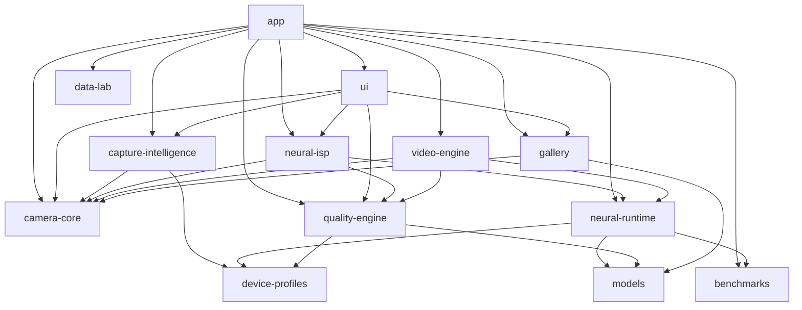

# Neural Camera System Architecture

## 1. High-Level Vision & Operating Philosophy
Neural Camera is a rootless, device-adaptive computational photography platform built for modern Android devices, targeting the OnePlus 15 (Snapdragon 8 Elite / 12GB RAM / Android 16) as its primary Tier-1 reference device.

Unlike naive camera applications that wrap camera previews with post-processing filters, Neural Camera treats capture as an integrated runtime graph:
- Intelligently plans multi-frame exposures before shutter release.
- Captures synchronized sensor telemetry (gyro, accel, exposure, timestamps).
- Executes temporal alignment and neural/classical reconstruction on validated accelerators (Qualcomm QNN NPU, Vulkan GPU, XNNPACK CPU).
- Inspects reconstructed images with Reality Guard to prevent synthetic hallucinations.
- Non-destructively preserves the original sensor data alongside the Master photograph.

---

## 2. Multi-Module Topology

### Module Responsibilities:
1. `:models`: Strict model descriptors, precision types, hardware backend targets, compatibility contracts.
2. `:device-profiles`: Device capability interrogation, camera specs, thermal thresholds, and device profiles (OnePlus 15, Generic Flagship, Generic Fallback).
3. `:benchmarks`: Empirical benchmarking engine, latency percentiles (median, p95, p99), memory peak tracking, privacy-safe telemetry.
4. `:quality-engine`: Image quality evaluator, sensor confidence estimator, and Reality Guard hallucination protection.
5. `:camera-core`: Camera2 contracts, physical lens routing, frame stream flow, bounded ring buffer repositories.
6. `:capture-intelligence`: Scene luminance & motion estimation, universal capture planning across shooting modes (AUTO, PRO, MASTER, AUTHENTIC).
7. `:neural-runtime`: Model registry, adaptive scheduler, thermal budget manager, memory allocation manager, hardware backends.
8. `:neural-isp`: Multi-frame temporal fusion, classical baseline ISP fallback pipeline (Zero Fake AI).
9. `:video-engine`: Video pipeline enforcing bounded compute per frame (selective keyframe enhancement, hardware passthrough).
10. `:gallery`: Non-destructive dual-storage repository (Original + Master + JSON metadata).
11. `:ui`: Minimalist, Leica/Zeiss-inspired Jetpack Compose user interface, tactile lens selector, mode carousel, subtle NEURAL status, diagnostics sheet.
12. `:data-lab`: Reference regression dataset (14 controlled scenes) and automated regression verification.
13. `:app`: Application entry point, dependency injection, and activity lifecycle management.
